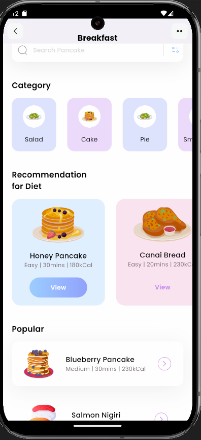

# Breakfast Recipe App (UI/UX Project)

## Overview
This project showcases the front-end design and implementation of a breakfast recipe app, developed to demonstrate skills in UI/UX and Flutter. The app features a visually appealing and intuitive interface, tailored for a seamless user experience.

## Features

### 1. **Modern UI/UX Design**
   - **Clean Layout**: The app has a well-structured layout that enhances readability and ease of use.
   - **Vibrant Colors**: Engaging colors are used to differentiate recipe categories and emphasize key information.
   - **User-Friendly Navigation**: Easy access to search, categories, and popular recipes with minimal clicks.

### 2. **Recipe Categories**
   - Users can explore various breakfast options organized into categories like Salad, Cake, Pie, and Smoothie.

### 3. **Diet Recommendations**
   - Specially curated recipes for diet-conscious users, complete with details like:
     - **Honey Pancake**: Easy | 30 mins | 180 Kcal
     - **Canai Bread**: Easy | 20 mins | 230 Kcal

### 4. **Popular Recipes**
   - Highlighted recipes that are popular among users, each showcasing preparation time, difficulty level, and calories.

## Technology
- **Framework**: Built with Flutter to ensure smooth performance and a responsive design.
- **UI/UX Tools**: The design was conceptualized using Figma.

## Getting Started
1. Clone the repository:
 
2. Navigate to the project directory:
 
3. Install Flutter dependencies:
   ```bash
   flutter pub get
   ```
4. Run the app on your emulator or physical device:
   ```bash
   flutter run
   ```

## Purpose
This project is intended to showcase my UI/UX design skills and document my Flutter Dev skills as they improve

## What it looks like



## Contributing
As this is a personal project, contributions are not expected. However, feedback is always welcome!
